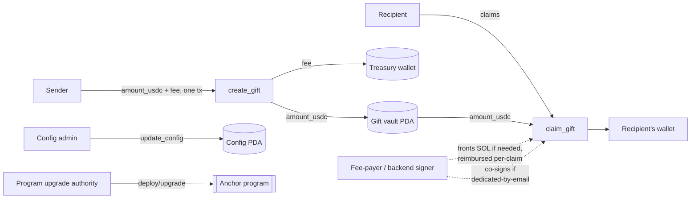

# Architecture — On-chain Program & Stack

Companion to [App.md](App.md) (product spec). This doc covers the two things App.md deliberately left open: the actual Solana program design and the concrete app stack, plus the swap-failure policy.

## On-chain program

**Framework: Anchor.** Handles serialization, account validation, and PDA boilerplate — the right tradeoff for a 3-day build handling real money, versus a native program where that boilerplate is all hand-rolled and easier to get subtly wrong.

**Mainnet, not devnet — but not "test with real money every time."** Tokenized stocks (Sunrise/Backpack) and real Jupiter liquidity only exist on mainnet, so the program's final deploy target is mainnet. For development and testing, use the `solana-dev` skill already in this repo (`.agents/skills/solana-dev`): LiteSVM/Mollusk for program unit tests, and **Surfpool's mainnet-state cloning** for integration tests against realistic forked mainnet state — real token mints, real Jupiter liquidity — without spending real funds on every run. Reserve actual small real-money transactions ($1–2) for final pre-launch smoke tests, not routine development.

### `Config` account (PDA, singleton)

Holds the platform's fee parameters so they're tunable without a redeploy, and so the take rate is publicly auditable on-chain rather than living in a backend.

- `admin: Pubkey` — the only signer allowed to update fee params
- `treasury: Pubkey` — where the fee portion goes
- `backend_authority: Pubkey` — the backend's signing key, the program's only way to recognize "the trusted backend" on-chain. Required co-signer on every dedicated-by-email claim (see `claim_gift` below) and the account sponsored (no-SOL) claims reimburse. Not part of the original design pass here — added while implementing the program itself, once it became clear there was no other way for `claim_gift` to check a co-signer's identity against anything on-chain.
- `fee_bps: u16` — default `250` (2.5%)
- `fee_min_usdc: u64` — default `150000` (i.e. $0.15 at USDC's 6 decimals)
- `bump: u8`

**`initialize_config(treasury, backend_authority, fee_bps, fee_min_usdc)`** — one-time setup, creates the `Config` PDA. Whoever calls it becomes `admin` (per the "hackathon-practical setup" below, expected to be a single founder-held keypair).

`update_config(fee_bps?, fee_min_usdc?, treasury?, backend_authority?)` — admin-only.

### `Gift` account (PDA)

Fields:
- `sender: Pubkey`
- `stock_mint: Pubkey` — target tokenized-stock mint
- `amount_usdc: u64` — escrowed amount
- `recipient_mode: enum { Dedicated, Fcfs }`
- `recipient_wallet: Option<Pubkey>` — set for dedicated-by-wallet
- `recipient_email_hash: Option<[u8; 32]>` — set for dedicated-by-email (a commitment, not the raw email, since identity is verified off-chain via Privy's own email-login verification)
- `status: enum { Pending, Claimed, Canceled }`
- `created_at: i64`
- `claim_seed: [u8; 16]` — random, generated client-side at creation
- `bump: u8`

**PDA seeds: `["gift", claim_seed]`.** Every gift — dedicated or FCFS — uses a random seed, not a derivable one (like sender + sequential nonce), specifically so a claim link can't be enumerated or guessed by scanning possible PDAs. The claim link itself just encodes `claim_seed`. Access control for *who* can claim is enforced by program logic, not by keeping the address itself secret (except for FCFS, where link secrecy is the whole point — see below).

**Escrow vault:** a USDC token account owned by the `Gift` PDA, created alongside it at gift-creation time.

### Instructions

**`create_gift(claim_seed, amount_usdc, stock_mint, recipient_mode, recipient_wallet?, recipient_email_hash?)`**
Creates the `Gift` PDA and its vault. Reads `fee_bps` / `fee_min_usdc` from `Config` and computes `fee = max(amount_usdc * fee_bps / 10_000, fee_min_usdc)`. In one atomic instruction: transfers `amount_usdc` from the sender into the vault, and `fee` from the sender into `Config.treasury`. The sender's wallet is charged `amount_usdc + fee` total; `Gift.amount_usdc` stores the escrowed face value only, so the recipient's later claim is unaffected by the fee — they always get exactly what the sender specified. Sets `status = Pending`.

**`claim_gift`** — authorization differs by recipient mode, but the instruction's job is always the same: verify authorization, set `status = Claimed`, transfer the vault's USDC straight into the **recipient's own USDC account**, close the vault (rent reclaimed). The program never touches the stock token or swap logic at all — see "Composing the swap" below for how conversion happens in the same transaction.
- **Dedicated-by-wallet:** on-chain check that `signer == gift.recipient_wallet`. Fully permissionless/client-signed.
- **Dedicated-by-email:** the program can't check an email address itself, so the backend's authority key is a **required co-signer** on the claim transaction — it only agrees to co-sign after checking the caller's Privy-verified email (already verified at login — Privy handles the OTP, no separate OAuth flow needed) against `recipient_email_hash`. This isn't extra work: the backend is already a required signer on sponsored claims for gas-fee-payer purposes (per App.md), so email-verification just piggybacks on that same signer requirement.
- **FCFS:** `recipient_wallet` is `None`, so there's no pubkey to check — whoever submits a valid transaction against that PDA first wins, and the vault closing on success is what stops a second claim (not a database flag). Link secrecy plus the off-chain anti-bot layer (CAPTCHA, rate limiting from App.md) is the actual access control here, not on-chain identity.

**`cancel_gift`** — signer must be `gift.sender`, `status` must still be `Pending`. Transfers vault USDC back to the sender, closes the vault and the `Gift` account (sender reclaims rent). Same instruction for both dedicated and FCFS gifts, per the "FCFS is cancelable too" decision in App.md.

### Fee-payer wallet: per-claim self-reimbursement, never touches treasury

The fee-payer wallet only ever fronts SOL for **no-SOL Privy claims** (see App.md), and gets reimbursed **within that same claim transaction**, not via any process touching `Config.treasury`:
1. Fee-payer wallet signs as fee payer, fronting the SOL for this transaction (it already holds a balance from prior reimbursements, or the initial manual seed).
2. `claim_gift` releases the vault's USDC to the recipient's own USDC account as normal.
3. A small additional leg in the same transaction swaps a slice of that just-released USDC to SOL and transfers it to the fee-payer wallet, reimbursing it.

Recipients connecting an already-funded wallet skip all three steps and just pay their own fee directly — no fee-payer involvement at all in that case. Needs a one-time manual SOL seed into the fee-payer wallet to front the first few no-SOL claims before reimbursements start covering it; self-sustaining after that. `Config.treasury` is never a party to this — it only ever receives the platform fee from `create_gift` and is never spent.

### Composing the swap (no Jupiter CPI needed)

Don't integrate Jupiter inside the Anchor program via CPI — that's real added complexity for a hackathon. Instead, build the claim as a single atomic Solana transaction with multiple instructions, assembled client/backend-side:

1. `claim_gift` (this program) — releases escrowed USDC into the recipient's own USDC account.
2. A Jupiter swap instruction (from Jupiter's Swap API, not a program CPI) — swaps that USDC into the target stock token, landing in the recipient's stock token account.

Both instructions land in one transaction, so this is atomic by construction: if the swap instruction fails for any reason (price moved past slippage tolerance, route disappeared), the *entire* transaction fails — including `claim_gift` — so the gift simply stays `Pending` and unclaimed rather than leaving USDC stuck mid-conversion. The recipient just retries. This also keeps the custom program's trusted surface small: it only ever custodies USDC and releases it to a verified recipient, never the swap itself.

## Wallets & keys

Four real keypairs to set up, plus one non-Solana credential. `Config` and every `Gift` PDA (with its vault) are program-derived — no private key exists for them, so they don't belong on this list at all.

| Key | Role | Sensitivity | Needs to be online? |
|---|---|---|---|
| Program upgrade authority | Deploys/upgrades the Anchor program | Highest — can replace program code entirely | No |
| Config admin | Calls `update_config` (fee_bps, fee_min_usdc, treasury address) | High — can redirect future fees | No |
| Treasury | Receives the platform fee from `create_gift` | Low (receive-only, never signs in this flow) | No |
| Fee-payer / backend signer | Fronts SOL for no-SOL Privy claims (reimbursed per-claim) **and** co-signs every dedicated-by-email claim after checking the caller's Privy-verified email. Its pubkey is stored on-chain as `Config.backend_authority` so `claim_gift` can actually verify a co-signer is this key, not just any signature. | Contained — holds only a small operational SOL float | **Yes** — held by the backend, signs automatically at claim time |
| Backpack Securities API key (ED25519) | Signs REST calls to Backpack's mint/redeem API for the Phase 2 redeem button | Separate system entirely, not a Solana wallet | Yes, backend-held |

**Hackathon-practical setup:** collapse the first three into a single founder-held keypair — none of them need to be automated, so there's no operational cost to keeping them together for now. Keep the fee-payer wallet genuinely separate and funded with only a small SOL float, since it's the one key that has to live on a running server — if it's ever compromised, the damage is capped at that float, never touching treasury or program upgrade authority.

## Swap failure / slippage policy

- Default slippage tolerance on the Jupiter quote: **1%**.
- The claim page already shows a live quote before the recipient confirms (per App.md), so they see the real expected amount before signing — this covers the common case.
- If the transaction lands but the swap leg fails anyway (price moved between quote fetch and confirmation), the atomic-transaction design means nothing is lost: the gift stays claimable, UI shows something like "Price moved — try again," and refetches a fresh quote for a retry.
- Tickers that consistently show high price impact at small sizes are a liquidity problem, not a slippage-policy problem — that's the existing "verify Jupiter liquidity depth per ticker" item in App.md, to be handled during implementation as already decided.

## Security hardening

Checked against the local `solana-dev` skill's security checklist (`.agents/skills/solana-dev/references/security.md`) — run that full checklist against the actual program code before mainnet deploy. These are the items specific to this design worth deciding now rather than discovering during implementation:

- **Fee-payer reimbursement must not be trustable client input.** The backend is the sole constructor of any transaction it co-signs as fee-payer — it always builds the full instruction set itself (`claim_gift` + swap + reimbursement leg) and never signs a client-assembled transaction. Otherwise a client can submit `claim_gift` alone, take the sponsored gas, and skip reimbursing the fee-payer wallet — a free drain, repeatable per fresh Privy wallet.
- **FCFS anti-bot measures (CAPTCHA, rate limiting) protect the website, not the program.** `claim_gift` is a public instruction, callable directly via RPC by anyone holding `claim_seed`, bypassing the frontend entirely. The actual security boundary for FCFS is **link secrecy alone** — treat CAPTCHA/rate-limiting as raising the bar against brute-force/enumeration through the site, not as a protocol-level guarantee.
- **Rent destination — one unified rule: rent from closed accounts goes to whoever paid the fee for the transaction that closed them.** Cancel → sender paid → sender receives. Self-paid claim (recipient has their own SOL) → recipient paid → recipient receives. Sponsored claim (fresh Privy wallet) → fee-payer wallet paid → fee-payer wallet receives, on top of its USDC-swap reimbursement — a rent-exempt USDC token account holds ~0.002 SOL, roughly 400x a base tx fee, so this meaningfully helps keep the fee-payer pool self-sustaining. Tradeoff, accepted: a no-SOL recipient nets slightly less overall than a self-paid recipient, since they don't receive the rent refund themselves. Both `Gift` PDA and its vault are always fully closed on both `claim_gift` and `cancel_gift` — no permanently-alive "audit trail" accounts; the on-chain transaction history plus the off-chain index (Neon) already cover that need without locking up rent forever. Creation rent (both accounts, at `create_gift`) is paid by the sender, alongside the escrow amount and fee.
- **Checked arithmetic on the fee calculation** — `amount_usdc.checked_mul(fee_bps)?.checked_div(10_000)?`, not bare operators, per the checklist's arithmetic/invariants section.
- **Hardcode a maximum `fee_bps`** (e.g. a `MAX_FEE_BPS: u16 = 1000` constant, 10%) enforced inside `update_config` itself — so even a compromised or malicious admin key can't set an arbitrary fee. Cheap, high-value, and directly addresses the checklist's "Hidden Backdoors / Trust Minimization" category.
- **Enforce a minimum output amount on the swap leg**, not just an advisory slippage percentage at quote time — otherwise it's a TOCTOU gap where the quote and the executed result can diverge.
- **Claim/cancel transfer exactly `Gift.amount_usdc`**, never "whatever the vault currently holds" — guards against donation-attack-style accounting confusion per the checklist, even though per-gift (not pooled) vaults make this low-severity here.
- **`stock_mint` isn't validated against a known-good list.** Low severity (self-contained per gift, no cross-user risk), but worth a documented policy — either an on-chain allowlist or accepting it as client/frontend-enforced only.
- **Use a trusted RPC provider** (Helius, Triton, etc.), not a public endpoint, for anything submitting real transactions — per the checklist's "Malicious / Observing RPC" entry, a malicious RPC can observe, delay, or sandwich transactions.

**Named but deliberately deferred — scoped correctly to Phase 2, not Phase 1:** Sunrise/Backpack tokenized stocks are freely-transferable, DeFi-composable SPL tokens with no KYC gate on holding or receiving (per App.md's Phase 2 rationale), so sanctions/jurisdiction screening and KYC only become relevant once tokens actually convert through Backpack's regulated brokerage rails — i.e. **Phase 2's "redeem to real shares" only**, not Phase 1 gifting. Both should be addressed when Phase 2 is actually built, not before. Separately, gifting appreciated property generally has tax implications for sender/recipient at the moment of transfer regardless of phase (same as gifting stock or crypto directly) — worth a "you should know this may have tax implications" note in the product copy at some point, but not a build item; the protocol isn't responsible for users' tax reporting any more than a wallet app is.

## Database schema (Drizzle / Neon)

**`gifts`** — the off-chain index of on-chain `Gift` state, plus off-chain-only extras:
`claim_seed` (PK, the same value encoded in the claim link), `gift_pda`, `sender_wallet`, `stock_mint`, `stock_symbol`, `amount_usdc`, `fee_usdc`, `recipient_mode` (`dedicated_wallet` / `dedicated_email` / `fcfs`), `recipient_wallet` (nullable), `recipient_email` (nullable), `status` (`pending` / `claimed` / `canceled`), `message` (nullable, off-chain only), `theme` (nullable, off-chain only), `created_at`, `claimed_at`, `canceled_at`, `create_tx_signature`, `claim_tx_signature`, `cancel_tx_signature`.

**`claim_attempts`** — anti-bot/rate-limiting only, per App.md's caveat that this is a website-level throttle, not a protocol-level guarantee: `claim_seed`, `wallet_address` or `ip_hash`, `attempted_at`, `captcha_verified`.

**`token_liquidity`** — cached result of the daily Jupiter liquidity check (see `GET /api/cron/check-liquidity` below), not on-chain data: `mint` (PK), `symbol`, `tradable`, `price_impact_pct` (nullable), `checked_at`.

## API routes (Next.js API routes)

- `POST /api/gifts` — index a newly created gift. Frontend builds and submits `create_gift` **itself** (sender pays/signs everything, no backend involvement needed for creation), then calls this route with the confirmed `create_tx_signature` to write the index row.
- `GET /api/gifts/:claim_seed` — fetch gift details for the claim page. Rate-limited/CAPTCHA-gated for `fcfs` mode specifically.
- `POST /api/gifts/:claim_seed/prepare-claim` — **only route that needs backend-side transaction construction.** Backend builds the full claim transaction (`claim_gift` + swap + reimbursement leg if sponsoring), co-signs as needed (fee-payer for no-SOL claims; for dedicated-by-email, also checks the caller's Privy-verified email against `recipient_email` before agreeing to co-sign). Returns the transaction for the recipient's wallet to sign and submit. Body includes `recipient_wallet`. **Must handle "no Jupiter route" as a real, expected case, not an unhandled error** — the daily liquidity cron (`GET /api/cron/check-liquidity`) only filters what's *selectable* when a gift is created; it doesn't protect a gift that was created before its stock later lost liquidity (the gap between cron runs, or between creation and claim). Building the swap leg here means calling Jupiter's swap API anyway, so a missing route surfaces naturally — return a clear error to the frontend instead of returning a transaction that will fail on submission. The escrowed USDC is never at risk either way (it sits in the on-chain `Gift` PDA until `claim_gift` or `cancel_gift` succeeds), but there's no "claim as USDC instead" fallback — that's deliberate, not an oversight, since real stock is the whole product premise. A stuck gift's only resolution today is the sender cancelling and refunding via `cancel_gift`.
- `POST /api/gifts/:claim_seed/confirm-claim` — frontend calls after the signed transaction lands on-chain; backend verifies confirmation and flips the index row to `claimed`. Also writes `recipient_wallet` here (not just at `create_gift` time) — for FCFS and dedicated-by-email gifts nobody knows which wallet will actually claim until this moment, and `?recipient=<wallet>` history queries need it set for every mode, not just dedicated-by-wallet.
- `POST /api/gifts/:claim_seed/confirm-cancel` — same pattern as create: sender builds/signs `cancel_gift` themselves (no backend co-sign needed), then confirms to update the index. (Just this one route, not a separate `/cancel` + `/confirm-cancel` pair — `create_gift` only ever needed one route too, `POST /api/gifts`, for the same reason: nothing backend-side happens before the client submits its own transaction.)
- `GET /api/gifts?sender=<wallet>` — sender's gift history (the "Gifts you've sent" half of `/history`, see App.md).
- `GET /api/gifts?recipient=<wallet>` — recipient's claimed-gift history (the "Gifts you've claimed" half of `/history`) — only ever returns `claimed` rows, since a gift only gets a `recipient_wallet` once claimed.
- `POST /api/captcha/verify` — server-side Turnstile siteverify call for a token from the claim page's widget (`fcfs` mode only); records the pass in `claim_attempts` via `ip_hash`. `prepare-claim` will check for a recent verified row here before proceeding for `fcfs` mode once it's built; this route's own job ends at confirming the token was real.
- `GET /api/stocks` — live catalog + prices for the stock picker and every "≈ N shares" quote across the app. Fetches the real Backpack Securities catalog from Sunrise's API (`https://api.sunrise.xyz/v1/tokens`, filtered to `assetClass === "stock" && issuer === "backpack_securities"`) and live prices from Jupiter's Price API v3 (`https://lite-api.jup.ag/price/v3`) — both public, no-auth, proxied server-side here only because Jupiter's API is CORS-blocked from the browser. Polled client-side every 15s via `useLiveStocks`. Filters out any mint `token_liquidity` has marked untradable (see the cron route below) before returning — a reference price alone doesn't mean a real swap route exists (a live example: `XYZ`/"Block" has a Jupiter price but zero trading liquidity). Not part of the gift-record API family above (no `claim_seed`), listed here because it's the other real route in the app.
- `GET /api/cron/check-liquidity` — Vercel Cron target (`vercel.json`, daily), auth-gated by `CRON_SECRET` (Vercel's own "Securing cron jobs" convention: it sends `Authorization: Bearer $CRON_SECRET` automatically once that env var is set on the project). Re-checks every catalog ticker against Jupiter's quote API (not just its price API) and upserts the result into `token_liquidity`, which the route above reads. Fails open on inconclusive results (rate-limited/transient errors leave the existing row untouched rather than guessing) — see `src/lib/liquidity.ts`. Can also be triggered manually via `scripts/check-jupiter-liquidity.mjs`, which just calls this same route rather than reimplementing the check.

The dividing line to keep in mind while building: **only `prepare-claim` involves the backend in transaction construction.** Create and cancel are fully client-signed with the backend only ever indexing after the fact — don't build backend transaction-building for those, it isn't needed and would just be extra surface area.

## App stack

| Layer | Choice | Why |
|---|---|---|
| Frontend | Next.js (React) | Fast to build, pairs with Vercel, huge wallet-adapter ecosystem. |
| Wallet connect | `@solana/wallet-adapter` | Standard library for Phantom/Solflare/Backpack connect buttons. |
| Embedded wallet + gas sponsorship | Privy (`@privy-io/react-auth`), native Solana sponsorship via Grid | Already decided in App.md. |
| On-chain program client | `@coral-xyz/anchor` (TS client) | Matches the Anchor program above. |
| Swap | Jupiter's public Swap/Quote API | Returns ready-to-use instructions — no CPI integration needed (verify current endpoint at build time, Jupiter's API surface shifts). |
| Live prices | Jupiter's public Price API v3, proxied through `GET /api/stocks` | Separate from the Swap API above — this is read-only quote data for the UI (stock picker, share estimates), not transaction construction. CORS-blocked from the browser, hence the server-side proxy. |
| Backend/API | Next.js API routes | CAPTCHA verification, rate-limit counters, DB reads/writes, building + co-signing claim transactions (including checking a claimer's Privy-verified email for dedicated-by-email gifts). Keeping this in the same Next.js app means one deployable unit instead of a separate backend service — the right tradeoff for the timeline. |
| Database | Neon (Postgres) | Already provisioned — see App.md's Data & backend architecture section. |
| ORM | Drizzle | Lighter and more serverless/edge-friendly than Prisma, pairs well with Neon's HTTP driver. |
| Rate limiting | A Neon table (counter + timestamp), not a separate Redis service | Fewer moving parts for the timeline; revisit only if read/write volume becomes an actual bottleneck. |
| CAPTCHA | Cloudflare Turnstile | Already decided in App.md. |
| Hosting | Vercel | Pairs naturally with Next.js, generous free tier, fast deploys. |
