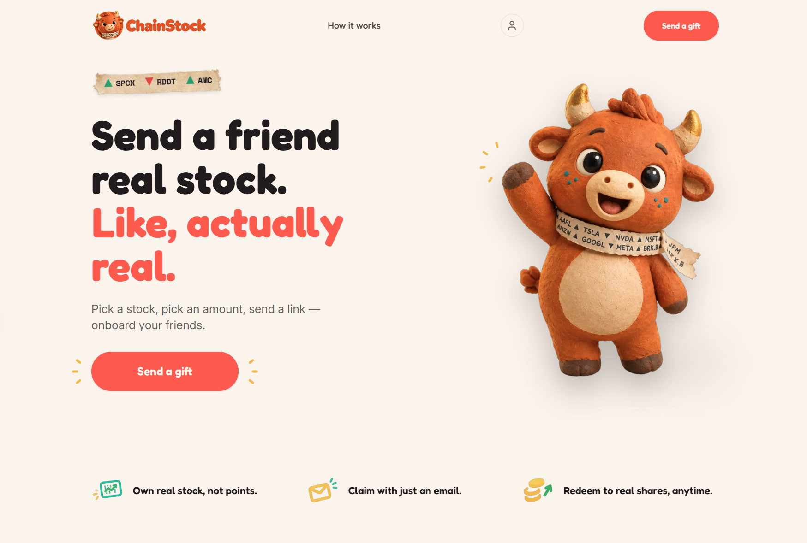
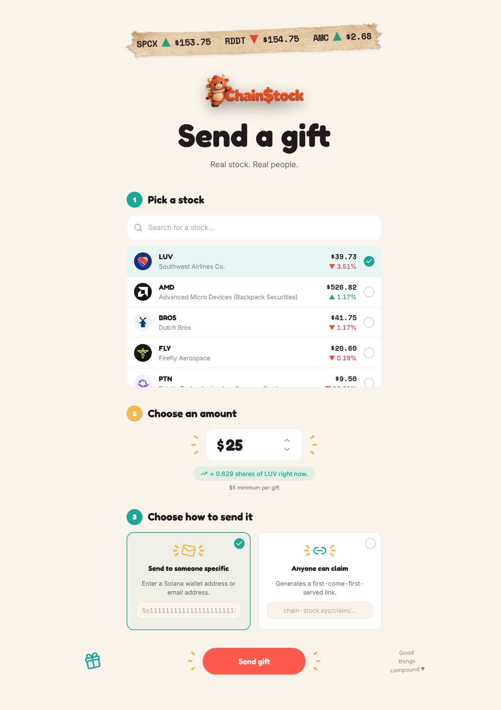
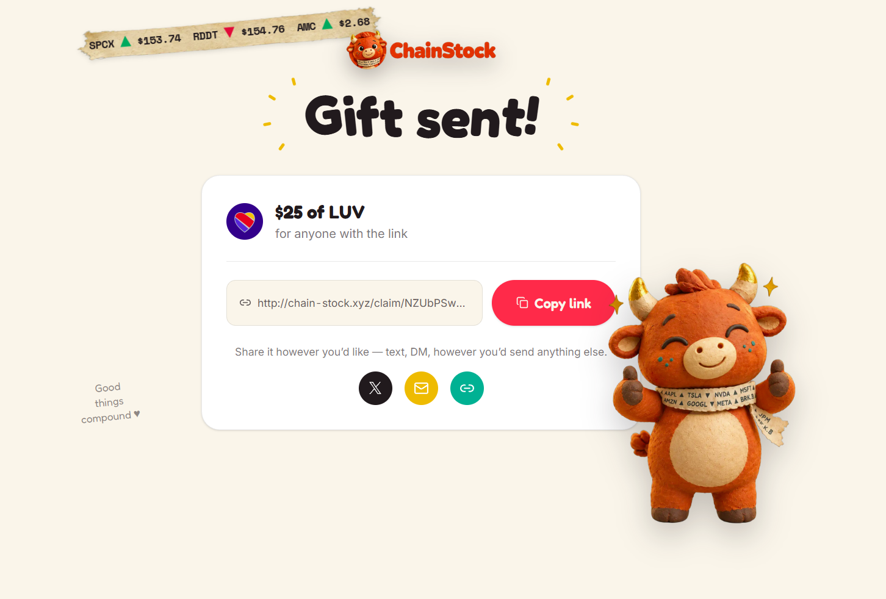
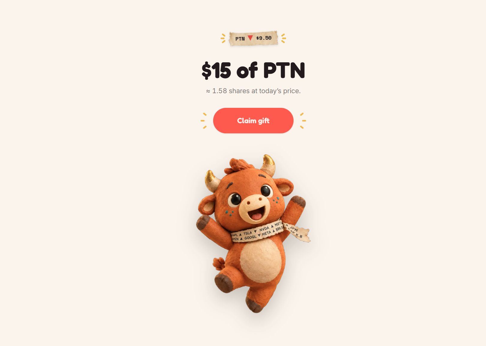
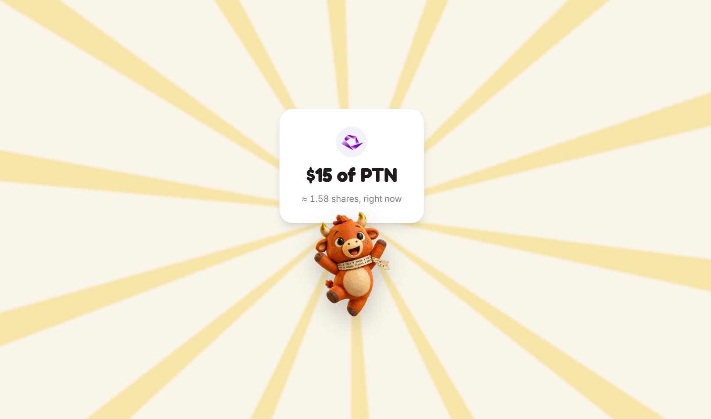
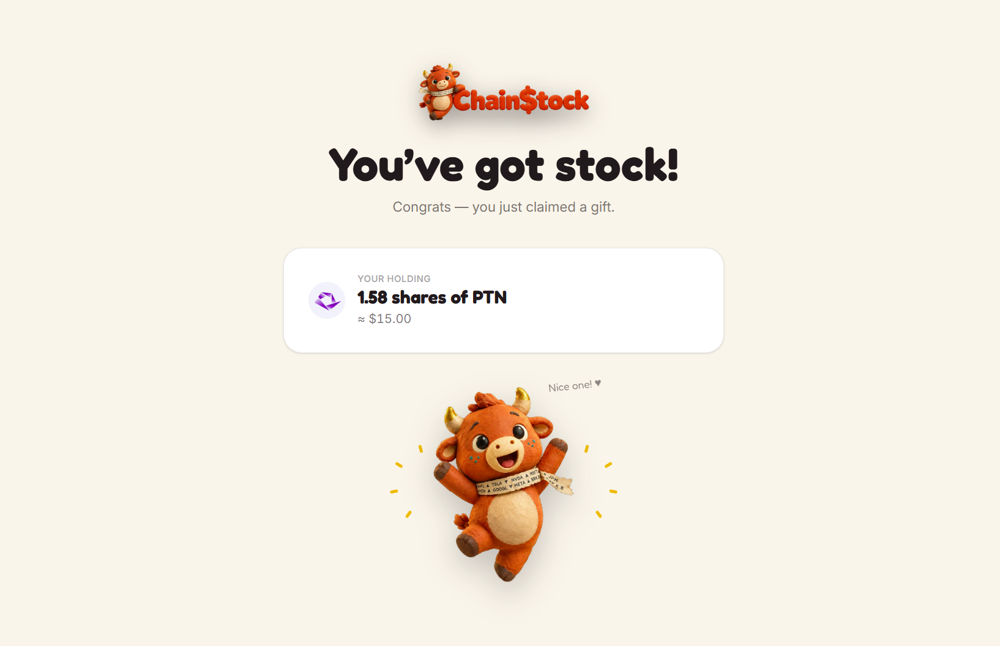
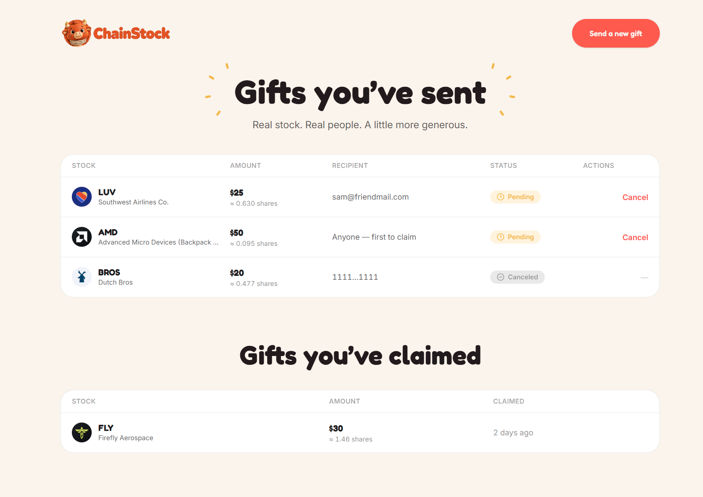
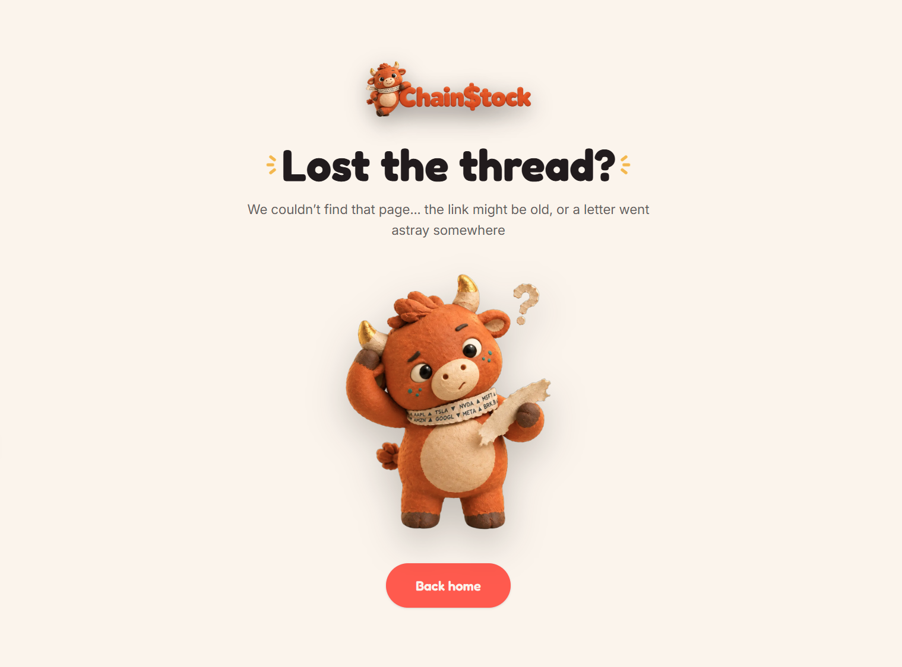

# ChainStock — Demo Manual

A walkthrough of every screen. `create_gift`/`claim_gift`/`cancel_gift`
are wired to the real, deployed Anchor program on **Solana mainnet** now
(see `../Wallets.md` for the deploy record) — this isn't a UI mockup,
it's screenshots of the actual live app, including a real claim (section
4 below is the first real mainnet gift, $5 of MSTR).

Screenshots are desktop only, captured straight from the running app —
nothing staged in an image editor.

## 1. Landing page

The pitch, for a cold visitor or a judge skimming fast: what ChainStock is,
one clear CTA ("Send a gift"), three feature callouts. Rally waves,
ticker strips flip in the background — purely decorative on this page,
not real prices.

## 2. Create a gift — `/gift`

The sender's flow: pick a stock from the real, live Backpack Securities
catalog (search included — the catalog is 40+ tickers), choose a dollar
amount (live share estimate updates as you type), then choose how to
send it — a specific wallet address or email address, or a
first-come-first-served link anyone can claim. "Send gift" builds and
submits a real `create_gift` transaction via the connected wallet.

## 3. Gift sent — `/gift/sent`

Confirmation right after "Send gift": a summary card, a copyable claim
link, and share buttons (X, email, copy-link). This is where a real
sender actually hands the link to whoever they're gifting.

## 4. Claim page — `/claim/[claimSeed]`

What the recipient sees after opening the link — often their very first
interaction with the product, possibly with no crypto wallet at all.
Deliberately **one** "Claim gift" button, not three ("Connect wallet" /
"Sign up" / "Claim") — clicking it routes into Privy's login (covering
both an existing wallet and walletless email/social sign-up) only if
they're not already authenticated, then completes the claim
automatically: the escrowed USDC swaps into the real stock token in the
same transaction, sponsored (gas-free) if the recipient's wallet has no
SOL yet. This exact screen is the real first mainnet gift, $5 of MSTR,
already claimed — the claim page doesn't show a different state for an
already-claimed gift, so it renders identically to a live pending one.

## 5. Claiming in progress

The brief unwrap animation between tapping "Claim gift" and landing on
the post-claim screen.

## 6. Post-claim — `/claim/[claimSeed]/success`

What claiming actually gets you: the holding (shares + current value),
Rally celebrating. The "Redeem to real shares" button from the original
mockup is intentionally hidden here — that's Phase 2 (calls Backpack's
real redeem API), not built yet.

## 7. Gift history — `/history`

Reached via the profile icon on the landing page (gated behind Privy
connect). Two stacked sections: gifts sent (with status and a cancel
action while still pending — for FCFS links too, not just dedicated
ones) and gifts claimed. Reads real data (`GET /api/gifts?sender=`/
`?recipient=`, keyed off the connected wallet).

## 8. 404 — any unmatched route

A real page, not a silent redirect to the landing page — so a stale or
mistyped link is clearly explained rather than just bouncing somewhere
unexplained.

## Video

`videos/claim-process.mp4` — the click-through claim flow.
